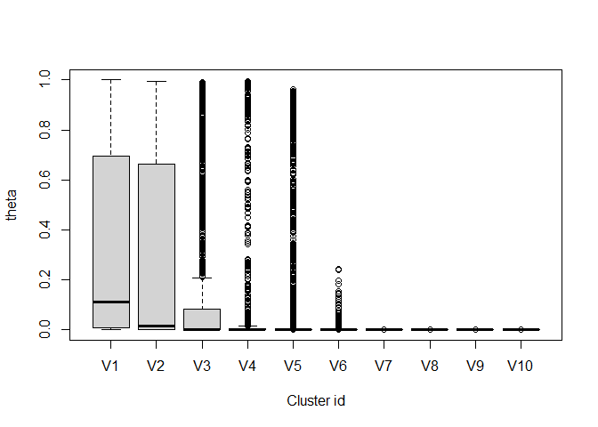
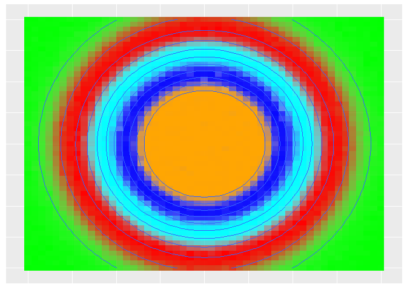

<!-- README.md is generated from README.Rmd. Please edit that file -->

# Authors

Denis Valle, Carlos Silva, Marcos Longo, Paulo Brando

# LidarLDA

<!-- badges: start -->
<!-- badges: end -->

The goal of LidarLDA is to fit a modified version of the Latent
Dirichlet Allocation (LDA) model to LiDAR data. The main benefit of
using this mixed-membership model is that it allows for some grid cells
to have varying proportions of each cluster whereas more standard
hard-clustering methods force grid cells to belong to a single cluster.
This model estimates two sets of parameters: one set characterizes each
grid cell in relation to the relative abundance of clusters while the
other set characterizes each cluster in relation to its absorptance
probabilities.

## Installation

You can install this package from [GitHub](https://github.com/) with:

``` r
library("devtools")
devtools::install_github("drvalle1/LidarLDA",build_vignettes=T)
```

## Fitting LidarLDA to simulated data

We start by showing how to fit the model based on simulated data with 5
clusters. The simulated datasets contain information for 2,601 pixels
(rows) and 30 height bins (columns), labeled z1, z2, …, z30.

The data in `sim_y5` consist of the number of returned light pulses
whereas the data in `sim_n5` consist of the number of incoming light
pulses, in each pixel and height bin. As a result, `sim_y5` is always
smaller or equal to `sim_n5`. These data were simulated with 5 clusters.

``` r
#library('devtools')
#devtools::install_github("drvalle1/LidarLDA",build_vignettes=T)
library(LidarLDA)

#basic characteristics of simulated data
dim(sim_y5) #sim_y5 is provided in the LidarLDA package
#> [1] 2601   33
dim(sim_n5) #sim_n5 is provided in the LidarLDA package
#> [1] 2601   33

colnames(sim_y5)
#>  [1] "x"    "y"    "topo" "z1"   "z2"   "z3"   "z4"   "z5"   "z6"   "z7"  
#> [11] "z8"   "z9"   "z10"  "z11"  "z12"  "z13"  "z14"  "z15"  "z16"  "z17" 
#> [21] "z18"  "z19"  "z20"  "z21"  "z22"  "z23"  "z24"  "z25"  "z26"  "z27" 
#> [31] "z28"  "z29"  "z30"
colnames(sim_n5)
#>  [1] "x"    "y"    "topo" "z1"   "z2"   "z3"   "z4"   "z5"   "z6"   "z7"  
#> [11] "z8"   "z9"   "z10"  "z11"  "z12"  "z13"  "z14"  "z15"  "z16"  "z17" 
#> [21] "z18"  "z19"  "z20"  "z21"  "z22"  "z23"  "z24"  "z25"  "z26"  "z27" 
#> [31] "z28"  "z29"  "z30"

#remove columns with coordinates and topography information
ind=which(colnames(sim_y5)%in%c('x','y','topo'))
sim_y5a=sim_y5[,-ind]
coord=sim_y5[,ind]

ind=which(colnames(sim_n5)%in%c('x','y','topo'))
sim_n5a=sim_n5[,-ind]
mean(sim_y5a<=sim_n5a)
#> [1] 1
```

We fit these simulated data using the code below. In this code, we
assume a maximum of 10 clusters and we rely on 10000 iterations of the
gibbs sampler with a burn-in of 9000 iterations. Finally, we just return
the posterior mean parameter estimates instead of all the posterior
samples by specifying `theta.post=F` and `phi.post=F`.

``` r
Model.Results=LidarLDA(y=data.matrix(sim_y5a),
                       n=data.matrix(sim_n5a),
                       nclust=10,
                       a.phi=1,b.phi=1,
                       gamma=0.1,ngibbs=10000,
                       nburn=9000,theta.post=F,phi.post=F)
```

We can assess convergence by examining the trace-plot of the
log-likelihood. This plot suggests that the algorithm has converged.

``` r
plot(Model.Results$llk,type='l',xlab='Iterations',
     ylab='Log-likelihood')
```


According to the `theta` matrix (i.e., the matrix that shows the
relative abundance of each cluster for each pixel), our model has
identified 5 (out of a maximum of 10) main clusters. These 5 first
clusters, on average, represent 99.8% of all observations in each pixel.

``` r
boxplot(Model.Results$theta,xlab='Cluster id',ylab='theta')
```



``` r
sum1=apply(Model.Results$theta[,1:5],1,sum)
mean(sum1)
#> [1] 0.9975733
```

Because this is based on simulated data, there is a nice pattern
regarding how the relative abundance of each cluster changes as a
function of topography. This is shown below. In this figure, each
cluster is depicted with a different color and relative abundance is
given by color opacity (i.e., 0 is transparent and 1 is completely
opaque). Contour lines show topography.

``` r
theta=Model.Results$theta[,1:5]
colnames(theta)=paste0('clust',1:5)
theta1=cbind(coord,theta)

library('ggplot2')
res5=ggplot(data=theta1,aes(x=x,y=y)) + 
  geom_tile(alpha = theta1$clust1, fill='red') +
  geom_tile(alpha = theta1$clust2, fill='green') +
  geom_tile(alpha = theta1$clust3, fill='cyan') +
  geom_tile(alpha = theta1$clust4, fill='orange') +
  geom_tile(alpha = theta1$clust5, fill='blue') +
  geom_contour(aes(x=x, y=y, z = topo))+
  theme(axis.title.x=element_blank(),
        axis.text.x=element_blank(),
        axis.ticks.x=element_blank(),
        axis.title.y=element_blank(),
        axis.text.y=element_blank(),
        axis.ticks.y=element_blank()) +
  xlab('')+ylab('')
res5
```



## Using the folding-in operation to detect temporal changes

It would be tempting to analyze LiDAR data collected for the same area
but in a different year (i.e., t=2) simply by re-running LidarLDA on
this new dataset. The problem with this approach is that it might
identify a different set of clusters, making temporal comparisons
challenging. To avoid this problem, we rely on the folding-in operation
to compare how the relative abundance of each cluster has changed
through time.

In the folding-in operation, the characteristics of each cluster
(captured by the *Φ* matrix) are kept constant and only the relative
abundances of these clusters (capture by the *Θ* matrix) are
re-estimated. As a result, assuming the grid cells were defined in a
comparable way in both time periods, we can directly compare the
relative abundances at time 1 (i.e., *Θ*<sub>*t* = 1</sub>) with those
from time 2 (i.e., *Θ*<sub>*t* = 2</sub>). To perform this operation, we
will rely on the function `LidarLDA_foldin`. As illustrated below, we
will need the posterior mean (or posterior samples) of the *Φ* matrix,
as estimated from the analysis of data at time t=1 using LidarLDA.

``` r
#data for t=2

colnames(sim_y5_t2) #this dataset is provided as part of the LidarLDA package
colnames(sim_n5_t2) #this dataset is provided as part of the LidarLDA package

#remove unnecessary columns
ind=which(colnames(sim_y5_t2)%in%c('x','y','topo'))
y_t2=sim_y5_t2[,-ind]
coord=sim_y5_t2[,ind]
ind=which(colnames(sim_n5_t2)%in%c('x','y','topo'))
n_t2=sim_n5_t2[,-ind]

#run folding-in operation
phi=Model.Results$phi
Model.Results.t2=LidarLDA_foldin(y=data.matrix(y_t2),
                                 n=data.matrix(n_t2),
                                 nclust=5,
                                 gamma=0.1,ngibbs=10000,
                                 nburn=9000,
                                 phi.post=F,
                                 phi.estim=data.matrix(phi[1:5,]),
                                 theta.post=F)
```

We can assess convergence by examining the trace-plot of the
log-likelihood. This plot suggests that the algorithm has converged.

``` r
plot(Model.Results.t2$llk,type='l',xlab='Iterations',
     ylab='Log-likelihood')
```


By spatially visualizing the relative abundances of each cluster at time
t=2, we can notice that there has been substantial spatial change. For
example, all the clusters have moved upward, with spatial expansion of
the cluster that dominated the lowland areas (i.e., green cluster) and
shrinkage of the highland area dominated by the orange cluster.

``` r
theta=Model.Results.t2$theta
colnames(theta)=paste0('clust',1:5)
theta2=cbind(coord,theta)

library('ggplot2')
res5=ggplot(data=theta2,aes(x=x,y=y)) + 
  geom_tile(alpha = theta2$clust1, fill='red') +
  geom_tile(alpha = theta2$clust2, fill='green') +
  geom_tile(alpha = theta2$clust3, fill='cyan') +
  geom_tile(alpha = theta2$clust4, fill='orange') +
  geom_tile(alpha = theta2$clust5, fill='blue') +
  geom_contour(aes(x=x, y=y, z = topo))+
  theme(axis.title.x=element_blank(),
        axis.text.x=element_blank(),
        axis.ticks.x=element_blank(),
        axis.title.y=element_blank(),
        axis.text.y=element_blank(),
        axis.ticks.y=element_blank()) +
  xlab('')+ylab('')
res5
```


## Editing empirical LiDAR data

To use this model to fit empirical LiDAR data, it is important to format
the data correctly. Here we show how we have formatted an empirical
LIDAR data set.

We start by assuming that we have a matrix called `lidar_data` which
holds the number of returns in each pixel and each height bin. Notice
that this matrix also contains the x and y coordinates of each pixel.

``` r
library(LidarLDA)

dim(lidar_data) #this dataset is contained within the LidarLDA package
#> [1] 200  83
colnames(lidar_data)
#>  [1] "ycoord" "xcoord" "z0.5"   "z1.5"   "z2.5"   "z3.5"   "z4.5"   "z5.5"  
#>  [9] "z6.5"   "z7.5"   "z8.5"   "z9.5"   "z10.5"  "z11.5"  "z12.5"  "z13.5" 
#> [17] "z14.5"  "z15.5"  "z16.5"  "z17.5"  "z18.5"  "z19.5"  "z20.5"  "z21.5" 
#> [25] "z22.5"  "z23.5"  "z24.5"  "z25.5"  "z26.5"  "z27.5"  "z28.5"  "z29.5" 
#> [33] "z30.5"  "z31.5"  "z32.5"  "z33.5"  "z34.5"  "z35.5"  "z36.5"  "z37.5" 
#> [41] "z38.5"  "z39.5"  "z40.5"  "z41.5"  "z42.5"  "z43.5"  "z44.5"  "z45.5" 
#> [49] "z46.5"  "z47.5"  "z48.5"  "z49.5"  "z50.5"  "z51.5"  "z52.5"  "z53.5" 
#> [57] "z54.5"  "z55.5"  "z56.5"  "z57.5"  "z58.5"  "z59.5"  "z60.5"  "z61.5" 
#> [65] "z62.5"  "z63.5"  "z64.5"  "z65.5"  "z66.5"  "z67.5"  "z68.5"  "z69.5" 
#> [73] "z70.5"  "z71.5"  "z72.5"  "z73.5"  "z74.5"  "z75.5"  "z76.5"  "z77.5" 
#> [81] "z78.5"  "z79.5"  "z80.5"
```

Next, we remove height bins for which there is not much data because
these are relatively uninformative. In our case, there are almost no
returns in bins above 31.5 m, as shown below. As a result, we sum all of
the returns above this threshold and assign these results to the last
height bin (i.e., `z31.5`).

``` r
dat=lidar_data

#get rid of height bins with few observations
apply(dat,2,sum)
#>  ycoord  xcoord    z0.5    z1.5    z2.5    z3.5    z4.5    z5.5    z6.5    z7.5 
#>    2100    1100 1963138  573839  655451  682255  628987  490115  338659  230384 
#>    z8.5    z9.5   z10.5   z11.5   z12.5   z13.5   z14.5   z15.5   z16.5   z17.5 
#>  169380  144748  135580  137653  143481  152269  164105  174558  181954  180954 
#>   z18.5   z19.5   z20.5   z21.5   z22.5   z23.5   z24.5   z25.5   z26.5   z27.5 
#>  170759  155484  135026  109929   87331   68756   52317   35583   23125   15287 
#>   z28.5   z29.5   z30.5   z31.5   z32.5   z33.5   z34.5   z35.5   z36.5   z37.5 
#>    6958    2401     898     160       0       0       0       0       0       0 
#>   z38.5   z39.5   z40.5   z41.5   z42.5   z43.5   z44.5   z45.5   z46.5   z47.5 
#>       0       0       0       0       0       0       0       0       0       0 
#>   z48.5   z49.5   z50.5   z51.5   z52.5   z53.5   z54.5   z55.5   z56.5   z57.5 
#>       0       0       0       0       0       0       0       0       0       0 
#>   z58.5   z59.5   z60.5   z61.5   z62.5   z63.5   z64.5   z65.5   z66.5   z67.5 
#>       0       0       0       0       0       0       0       0       0       0 
#>   z68.5   z69.5   z70.5   z71.5   z72.5   z73.5   z74.5   z75.5   z76.5   z77.5 
#>       0       0       0       0       0       0       0       0       0       0 
#>   z78.5   z79.5   z80.5 
#>       0       0       0
limite='z31.5'
ind=which(colnames(dat)==limite)
dat1=dat

#all of the returns above this threshold get stored in the highest bin
dat1[,ind]=apply(dat1[,ind:ncol(dat)],1,sum)
dat2=dat1[,1:ind]
ind=grep('z',colnames(dat2))
coord=dat2[,-ind]
dat3=dat2[,ind]
```

I then create the matrices `y` and `n`, containing the number of
returned light pulses and incoming light pulses, respectively, for each
pixel and each height bin.

``` r
y=z=dat3
nheight=ncol(z)
npix=nrow(z)

#get n matrix containing the incoming light pulses for each pixel and height bin
n=matrix(NA,npix,nheight)
for (i in nheight:2){
  n[,i]=rowSums(z)
  z=z[,-i]
}
n[,1]=y[,1]

#get names
colnames(n)=colnames(y)

#eliminate the first column because y/n is always equal to 1 for that column
n1=n[,-1]
y1=y[,-1]
```

Finally, we finish formatting these data by randomly sampling 500 pulses
whenever the number of incoming pulses is greater than 500. This
procedure ensures an approximately even number of pulses in each height
bin in each pixel (here arbitrarily set to 500) and can help ensure a
more rapid convergence of the algorithm.

``` r
set.seed(1)
prob=y1/n1
thresh=500
cond=n1>thresh
n1[cond]=thresh
y1[cond]=rbinom(sum(cond),size=thresh,prob[cond])
```
