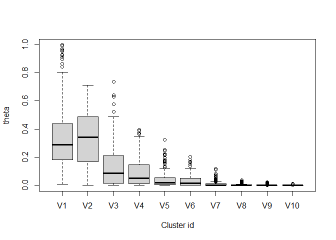
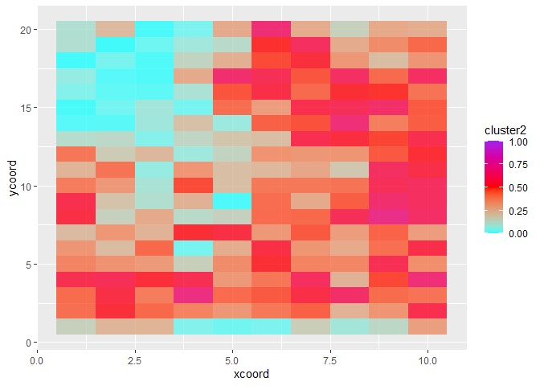

<!-- README.md is generated from README.Rmd. Please edit that file -->

# Authors

Denis Valle, Carlos Silva, Marcos Longo, Paulo Brando

# LidarLDA

<!-- badges: start -->
<!-- badges: end -->

The goal of LidarLDA is to fit a modified version of the Latent
Dirichlet Allocation (LDA) model to LiDAR data. The main benefit of
using this mixed-membership model is that it allows for some grid cells
to have varying proportions of each cluster whereas more standard
hard-clustering methods force grid cells to belong to a single cluster.
This model estimates two sets of parameters: one set characterizes each
grid cell in relation to the relative abundance of clusters while the
other set characterizes each cluster in relation to its absorptance
probabilities.

## Installation

You can install this package from [GitHub](https://github.com/) with:

``` r
library("devtools")
devtools::install_github("drvalle1/LidarLDA",build_vignettes=T)
```

## Fitting the model to simulated data

We start by showing how to fit the model based on simulated data with 5
clusters. The simulated datasets contain information for 2,000 pixels
(rows) and 50 height bins (columns), labeled z1, z2, …, z50.

The data in `sim_y5` consist of the number of returned light pulses
whereas the data in `sim_n5` consist of the number of incoming light
pulses, in each pixel and height bin. As a result, `sim_y5` is always
smaller or equal to `sim_n5`. These data were simulated with 5 clusters.

``` r
#library('devtools')
#devtools::install_github("drvalle1/LidarLDA",build_vignettes=T)
library(LidarLDA)

#basic characteristics of simulated data
dim(sim_y5)
#> [1] 2000   50
dim(sim_n5)
#> [1] 2000   50

colnames(sim_y5)
#>  [1] "z1"  "z2"  "z3"  "z4"  "z5"  "z6"  "z7"  "z8"  "z9"  "z10" "z11" "z12"
#> [13] "z13" "z14" "z15" "z16" "z17" "z18" "z19" "z20" "z21" "z22" "z23" "z24"
#> [25] "z25" "z26" "z27" "z28" "z29" "z30" "z31" "z32" "z33" "z34" "z35" "z36"
#> [37] "z37" "z38" "z39" "z40" "z41" "z42" "z43" "z44" "z45" "z46" "z47" "z48"
#> [49] "z49" "z50"
colnames(sim_n5)
#>  [1] "z1"  "z2"  "z3"  "z4"  "z5"  "z6"  "z7"  "z8"  "z9"  "z10" "z11" "z12"
#> [13] "z13" "z14" "z15" "z16" "z17" "z18" "z19" "z20" "z21" "z22" "z23" "z24"
#> [25] "z25" "z26" "z27" "z28" "z29" "z30" "z31" "z32" "z33" "z34" "z35" "z36"
#> [37] "z37" "z38" "z39" "z40" "z41" "z42" "z43" "z44" "z45" "z46" "z47" "z48"
#> [49] "z49" "z50"

mean(sim_y5<=sim_n5)
#> [1] 1
```

We fit these simulated data using the code below. In this code, we
assume a maximum of 10 clusters and we rely on 10000 iterations of the
gibbs sampler with a burn-in of 9000 iterations. Finally, we just return
the posterior mean parameter estimates instead of all the posterior
samples by specifying `theta.post=F` and `phi.post=F`.

``` r
Model.Results=LidarLDA(y=data.matrix(sim_y5),
                       n=data.matrix(sim_n5),
                       nclust=10,
                       a.phi=1,b.phi=1,
                       gamma=0.1,ngibbs=10000,
                       nburn=9000,theta.post=F,phi.post=F)
```

We can assess convergence by examining the trace-plot of the
log-likelihood. This plot suggests that the algorithm has converged.

``` r
plot(Model.Results$llk,type='l',xlab='Iterations',
     ylab='Log-likelihood')
```


According to the `theta` matrix (i.e., the matrix that shows the
relative abundance of each cluster for each pixel), our model has
identified 5 (out of a maximum of 10) main clusters. These 5 first
clusters, on average, represent 99.8% of all observations in each pixel.

``` r
boxplot(Model.Results$theta,xlab='Cluster id',ylab='theta')
```


``` r
sum1=apply(Model.Results$theta[,1:5],1,sum)
mean(sum1)
#> [1] 0.9977585
```

Because this is based on simulated data, there is a nice pattern
regarding how the relative abundance of each cluster changes as a
function of pixel id. This is shown below.

``` r
theta=Model.Results$theta
npix=nrow(theta)
plot(NA,NA,xlim=c(0,npix),ylim=c(0,1),ylab='theta',xlab='pixel id')
for (i in 1:5) lines(1:npix,theta[,i],col=i)
```


## Editing empirical LIDAR data

To use this model to fit empirical LIDAR data, it is important to format
the data correctly. Here we show how we have formatted an empirical
LIDAR data set.

We start by assuming that we have a matrix called `lidar_data` which
holds the number of returns in each pixel and each height bin. Notice
that this matrix also contains the x and y coordinates of each pixel.

``` r
library(LidarLDA)

dim(lidar_data)
#> [1] 200  83
colnames(lidar_data)
#>  [1] "ycoord" "xcoord" "z0.5"   "z1.5"   "z2.5"   "z3.5"   "z4.5"   "z5.5"  
#>  [9] "z6.5"   "z7.5"   "z8.5"   "z9.5"   "z10.5"  "z11.5"  "z12.5"  "z13.5" 
#> [17] "z14.5"  "z15.5"  "z16.5"  "z17.5"  "z18.5"  "z19.5"  "z20.5"  "z21.5" 
#> [25] "z22.5"  "z23.5"  "z24.5"  "z25.5"  "z26.5"  "z27.5"  "z28.5"  "z29.5" 
#> [33] "z30.5"  "z31.5"  "z32.5"  "z33.5"  "z34.5"  "z35.5"  "z36.5"  "z37.5" 
#> [41] "z38.5"  "z39.5"  "z40.5"  "z41.5"  "z42.5"  "z43.5"  "z44.5"  "z45.5" 
#> [49] "z46.5"  "z47.5"  "z48.5"  "z49.5"  "z50.5"  "z51.5"  "z52.5"  "z53.5" 
#> [57] "z54.5"  "z55.5"  "z56.5"  "z57.5"  "z58.5"  "z59.5"  "z60.5"  "z61.5" 
#> [65] "z62.5"  "z63.5"  "z64.5"  "z65.5"  "z66.5"  "z67.5"  "z68.5"  "z69.5" 
#> [73] "z70.5"  "z71.5"  "z72.5"  "z73.5"  "z74.5"  "z75.5"  "z76.5"  "z77.5" 
#> [81] "z78.5"  "z79.5"  "z80.5"
```

Next, we remove height bins for which there is not much data because
these are relatively uninformative. In our case, there are almost no
returns in bins above 31.5 m, as shown below. As a result, we sum all of
the returns above this threshold and assign these results to the last
height bin (i.e., `z31.5`).

``` r
dat=lidar_data

#get rid of height bins with few observations
apply(dat,2,sum)
#>  ycoord  xcoord    z0.5    z1.5    z2.5    z3.5    z4.5    z5.5    z6.5    z7.5 
#>    2100    1100 1963138  573839  655451  682255  628987  490115  338659  230384 
#>    z8.5    z9.5   z10.5   z11.5   z12.5   z13.5   z14.5   z15.5   z16.5   z17.5 
#>  169380  144748  135580  137653  143481  152269  164105  174558  181954  180954 
#>   z18.5   z19.5   z20.5   z21.5   z22.5   z23.5   z24.5   z25.5   z26.5   z27.5 
#>  170759  155484  135026  109929   87331   68756   52317   35583   23125   15287 
#>   z28.5   z29.5   z30.5   z31.5   z32.5   z33.5   z34.5   z35.5   z36.5   z37.5 
#>    6958    2401     898     160       0       0       0       0       0       0 
#>   z38.5   z39.5   z40.5   z41.5   z42.5   z43.5   z44.5   z45.5   z46.5   z47.5 
#>       0       0       0       0       0       0       0       0       0       0 
#>   z48.5   z49.5   z50.5   z51.5   z52.5   z53.5   z54.5   z55.5   z56.5   z57.5 
#>       0       0       0       0       0       0       0       0       0       0 
#>   z58.5   z59.5   z60.5   z61.5   z62.5   z63.5   z64.5   z65.5   z66.5   z67.5 
#>       0       0       0       0       0       0       0       0       0       0 
#>   z68.5   z69.5   z70.5   z71.5   z72.5   z73.5   z74.5   z75.5   z76.5   z77.5 
#>       0       0       0       0       0       0       0       0       0       0 
#>   z78.5   z79.5   z80.5 
#>       0       0       0
limite='z31.5'
ind=which(colnames(dat)==limite)
dat1=dat

#all of the returns above this threshold get stored in the highest bin
dat1[,ind]=apply(dat1[,ind:ncol(dat)],1,sum)
dat2=dat1[,1:ind]
ind=grep('z',colnames(dat2))
coord=dat2[,-ind]
dat3=dat2[,ind]
```

I create the matrices `y` and `n`, containing the number of returned
light pulses and incoming light pulses, respectively, for each pixel and
each height bin.

``` r
y=z=dat3
nheight=ncol(z)
npix=nrow(z)

#get n matrix containing the incoming light pulses for each pixel and height bin
n=matrix(NA,npix,nheight)
for (i in nheight:2){
  n[,i]=rowSums(z)
  z=z[,-i]
}
n[,1]=y[,1]

#get names
colnames(n)=colnames(y)

#eliminate the first column because y/n is always equal to 1 for that column
n1=n[,-1]
y1=y[,-1]
```

Finally, we finish formatting these data by randomly sampling 500 pulses
whenever the number of incoming pulses is greater than 500. This
procedure ensures an approximately even number of pulses in each height
bin in each pixel (here arbitrarily set to 500) and can help ensure a
more rapid convergence of the algorithm.

``` r
set.seed(1)
prob=y1/n1
thresh=500
cond=n1>thresh
n1[cond]=thresh
y1[cond]=rbinom(sum(cond),size=thresh,prob[cond])
```

## Fitting empirical LIDAR data

We can now fit LidarLDA to the `y1` and `n1` matrices.

``` r
Model.Results=LidarLDA(y=data.matrix(y1),
                       n=data.matrix(n1),
                       nclust=10,
                       a.phi=1,b.phi=1,
                       gamma=0.1,ngibbs=10000,
                       nburn=9000,theta.post=F,phi.post=F)
```

## Interpreting and visualizing model results

Our results suggest that 6 main clusters exist in this data set.

``` r
boxplot(Model.Results$theta,ylab='theta',xlab='Cluster id')
```



The estimated absorptance probabilities for each cluster are stored in
the object `phi`. These results help to characterize the identified
clusters. For example, these results suggest that cluster 1 represents
bare ground, grasses and short vegetation while clusters 2 and 3 have
increasingly taller vegetation.

``` r
par(mfrow=c(3,2),mar=c(1,1,3,1),oma=c(4,4,1,1))
phi=data.matrix(Model.Results$phi)
for (i in 1:6) plot(phi[i,],type='h',main=i,xlab='',ylim=c(0,1))
mtext(side=1,at=0.5,outer=T,line=1,'Height (m)')
mtext(side=2,at=0.5,outer=T,line=1,'Absorptance probability')
```


The spatial distribution of clusters 1-3 are shown below.

``` r
library('ggplot2')
theta=Model.Results$theta
colnames(theta)=paste0('cluster',1:10)
results=cbind(coord,theta)

ggplot() +
  geom_tile(data = results, alpha = 0.8,aes(x = xcoord, y = ycoord,fill = cluster1)) +
  scale_fill_gradient2(low = "cyan", mid = "red",high='purple',limits=c(0,1),midpoint=0.5)
```


``` r
ggplot() +
  geom_tile(data = results, alpha = 0.8,aes(x = xcoord, y = ycoord,fill = cluster2)) +
  scale_fill_gradient2(low = "cyan", mid = "red",high='purple',limits=c(0,1),midpoint=0.5)
```



``` r
ggplot() +
  geom_tile(data = results, alpha = 0.8,aes(x = xcoord, y = ycoord,fill = cluster3)) +
  scale_fill_gradient2(low = "cyan", mid = "red",high='purple',limits=c(0,1),midpoint=0.5)
```


## Generating simulated data

Here we provide the code showing how the simulated data sets `sim_y5`
and `sim_n5`, used in the beginning of this vignette, were generated.
This code can be useful for users interested in modifying the simulated
data sets to see how the model behaves for different settings.

``` r
rm(list=ls(all=TRUE))
set.seed(421)

npix=2000
nheight=50
nclust=5
base=floor(npix/(nclust-2))

#generate thetas
x=seq(from=-1,to=1,length.out=base)
y=sqrt(1-(x^2))*0.1
min1=0.0001
y[y<min1]=min1
# plot(x,y)

init=floor(npix/nclust)
seq1=c(seq(from=1,to=npix,by=init),npix)

theta=matrix(min1,npix,nclust)
for (i in 1:nclust){
  seq2=seq1[i]:(seq1[i]+base-1)
  seq3=seq2[seq2<=npix]
  theta[seq3,i]=y[1:length(seq3)]
}
theta=theta/matrix(apply(theta,1,sum),npix,nclust)
theta.true=theta

plot(NA,NA,xlim=c(0,npix),ylim=c(0,1),xlab='pixel id',ylab='theta')
for (i in 1:nclust) lines(1:npix,theta[,i],col=i)
```


``` r
#generate phi
tmp=matrix(rbeta(nclust*nheight,0.5,0.5),nclust,nheight)
tmp[,1:nclust]=diag(0.8,nclust)  
phi=tmp
phi.true=phi

#get n
n2=matrix(round(runif(npix*nheight,min=10,max=200)),npix,nheight)

#generate actual observations y
y=matrix(0,npix,nheight)
array1=array(NA,dim=c(npix,nheight,nclust,2))
for (i in 1:npix){
  for (j in 1:nheight){
    tmp=rmultinom(1,size=n2[i,j],prob=theta[i,])
    for (k in 1:nclust){
      tmp1=rbinom(1,size=tmp[k],prob=phi[k,j])
      array1[i,j,k,1]=tmp1
      array1[i,j,k,2]=tmp[k]-tmp1
      y[i,j]=y[i,j]+tmp1
    }
  }
}
mean(y<=n2)
#> [1] 1
# image(data.matrix(y/n2))

#add column names
colnames(y)=colnames(n2)=paste('z',1:nheight,sep='')
sim_y5=y
sim_n5=n2
```
